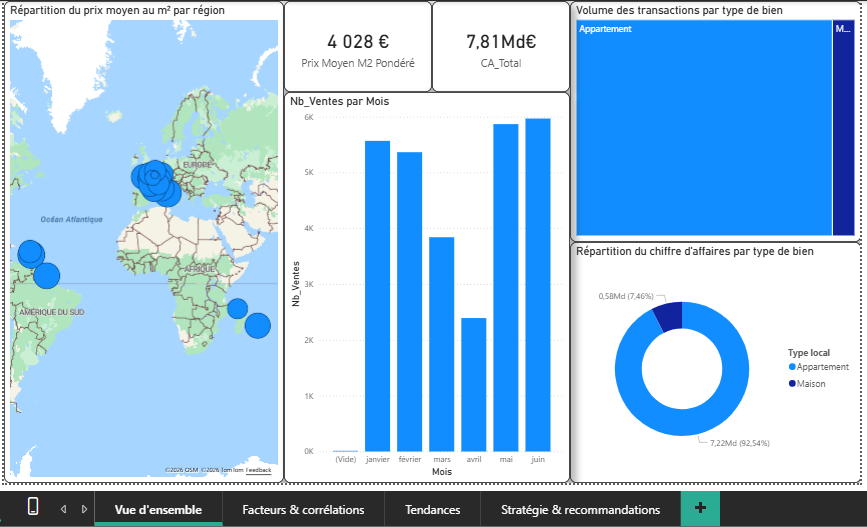

# 🏠 DATAlmmo : Analyse Stratégique du Marché Immobilier (Laplace Immo)

Ce projet a été réalisé en groupe dans le cadre de mon **Master 1 Data Analytics**. L'objectif était d'accompagner la transformation digitale du réseau national **Laplace Immo** en exploitant les données foncières (DVF) et les recensements de population de l'INSEE.

## 🎯 Contexte et Enjeux
Le projet **DATAImmo** visait à fournir aux agences régionales des outils décisionnels pour mieux comprendre les dynamiques du marché immobilier français. En tant que Data Analyst, j'ai pris en charge la phase de **Visualisation et d'Analyse Décisionnelle** afin de traduire une base de données technique en insights stratégiques pour la direction générale.

## 📊 Ma Contribution : Dashboard Power BI

Pour répondre aux besoins métiers, j'ai structuré le rapport Power BI autour des quatre types d'analyses fondamentales :

* **Analyse Descriptive** : Visualisation des volumes de ventes et des prix moyens au m² par région et département.
* **Analyse Diagnostique** : Identification des corrélations entre les caractéristiques des biens et les prix de vente.
* **Analyse Prédictive** : Exploration de pistes pour la modélisation des tendances futures des prix immobiliers.
* **Analyse Prescriptive** : Formulation de recommandations pour orienter les agences locales dans l'accompagnement de leurs clients.

## 🛠️ Stack Technique
Bien que ce projet soit le fruit d'un travail d'équipe (conception de la base de données, normalisation 3NF), ma mission s'est concentrée sur :
- **Business Intelligence** : Modélisation de données et création de rapports interactifs sous **Power BI** (DAX, Storytelling).
- **Extraction & Analyse** : Requêtage SQL pour préparer les indicateurs clés.
- **Innovation** : Prototypage de pipelines d'automatisation avec **KNIME** et développement d'une interface de simulation sous **Streamlit**.

## 📂 Structure du dépôt
* 📊 **[Rapport Power BI](./DATAimmo_dashboard.pbit)** : Le fichier source de mes analyses.
* 📄 **[Sujet du Projet](./sujet.pdf)** : Le cahier des charges complet détaillant les livrables.
* 🖼️ **[Galerie de captures](./images)** : Accès direct aux visuels des dashboards pour une consultation rapide.

---
*Projet collectif réalisé avec rigueur dans le cadre de mon Master 1 à l'Université de Toulon.*
